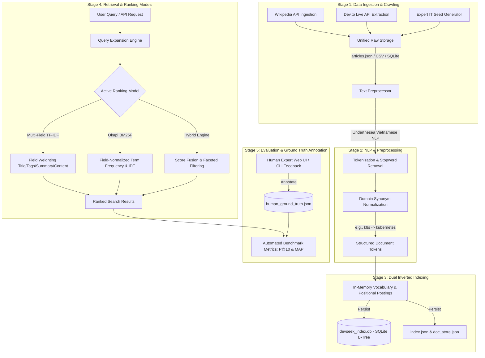

# DevSeek: An Industrial-Grade Vertical Search Engine for IT & Software Engineering
**Academic Capstone Project & Technical Report**

---

## Executive Summary & Abstract

**DevSeek** is an advanced, full-stack **Vertical Search Engine** engineered specifically for the Information Technology, Computer Science, and Software Engineering domain. While general-purpose web search engines often return superficial answers or generic documentation, vertical search engines focus on domain specificity, structured metadata indexing, and tailored ranking algorithms to deliver high-precision technical retrieval.

This system is constructed from the ground up without relying on black-box vector databases or pre-built search engines (such as Elasticsearch or Lucene). Instead, it demonstrates the core computer science principles of **Information Retrieval (IR)**, **Data Engineering**, **Relational B-Tree Indexing**, **Vietnamese Natural Language Processing (NLP)**, and **Dual Ranking Optimization**.

### Key Architectural Innovations:
1. **Hybrid Data Ingestion Pipeline**: Combines real-time API extraction (Wikipedia API & Dev.to API) with curated expert seed datasets (`crawler/`).
2. **Relational B-Tree Inverted Index (`devseek_index.db`)**: Transitions from naive JSON indexing to a high-performance relational SQLite storage engine, enabling multi-field posting queries, term positional lookups, and sub-millisecond retrieval scaling (`engine/sqlite_indexer.py`).
3. **Dual Multi-Field Ranking Engine**: Implements both **Multi-Field TF-IDF** (with custom field weighting across Title, Tags, Summary, and Content) and state-of-the-art **Okapi BM25F** (incorporating field-level length normalization) (`engine/ranker.py`).
4. **Scientific Evaluation & Human Relevance Feedback**: Integrates both automated keyword benchmark evaluation and a rigorous **Gold Standard Human Ground Truth Annotation Protocol** via interactive CLI and Web UI (`evaluation/`, `web/annotate`).

---

## System Architecture & Data Flow

The DevSeek architecture follows a modular, 5-stage processing pipeline illustrated below:



---

## Theoretical Background & Mathematical Formulations

### 1. Multi-Field TF-IDF Ranking Model
Traditional TF-IDF treats documents as flat bags of words. DevSeek implements **Multi-Field TF-IDF**, assigning distinct importance weights to structured fields: Title ($w_t=3.0$), Tags ($w_g=2.5$), Summary ($w_s=1.5$), and Content ($w_c=1.0$).

The weighted Term Frequency $TF(q, d)$ for term $q$ in document $d$ is defined as:

$$TF(q, d) = 1 + \ln\left( w_t \cdot tf_{title}(q, d) + w_g \cdot tf_{tags}(q, d) + w_s \cdot tf_{summary}(q, d) + w_c \cdot tf_{content}(q, d) \right)$$

The smoothed Inverse Document Frequency $IDF(q)$ across total documents $N$ and document frequency $df(q)$ is:

$$IDF(q) = \ln\left( \frac{N + 1}{df(q) + 1} \right) + 1.0$$

The total relevance score of document $d$ for query $Q = \{q_1, q_2, \dots, q_k\}$ is:

$$Score_{TFIDF}(Q, d) = \sum_{q \in Q} \Big( TF(q, d) \times IDF(q) \times Boost(q) \Big)$$

---

### 2. Okapi BM25F (Field-Normalized BM25)
Okapi BM25 is widely recognized as one of the most effective probabilistic retrieval models. DevSeek extends standard BM25 into **Okapi BM25F**, normalizing term frequencies based on field-specific average lengths to prevent long fields from unfairly dominating shorter, high-signal fields like titles.

Given standard parameters $k_1 = 1.5$ and $b = 0.75$, the normalized term frequency $\tilde{tf}(q, d)$ across fields $f \in \{\text{title, tags, summary, content}\}$ is calculated as:

$$\tilde{tf}(q, d) = \sum_{f} w_f \cdot \frac{tf_f(q, d)}{1 - b + b \cdot \left( \frac{len_f(d)}{avdl_f} \right)}$$

Where $len_f(d)$ is the token length of field $f$ in document $d$, and $avdl_f$ is the mean token length of field $f$ across the entire corpus.

The probabilistic BM25 Inverse Document Frequency is formulated as:

$$IDF_{BM25}(q) = \max\left( 0.1, \ln\left( \frac{N - df(q) + 0.5}{df(q) + 0.5} + 1 \right) \right)$$

The final BM25F score is computed as:

$$Score_{BM25F}(Q, d) = \sum_{q \in Q} IDF_{BM25}(q) \cdot \frac{\tilde{tf}(q, d) \cdot (k_1 + 1)}{\tilde{tf}(q, d) + k_1} \cdot Boost(q)$$

---

### 3. Evaluation Metrics: Precision@k & MAP
To evaluate search accuracy scientifically, DevSeek computes two critical information retrieval metrics:

#### Precision at $k$ ($P@k$):
Measures the proportion of retrieved documents in the top-$k$ results that are truly relevant:

$$P@k = \frac{|\text{RetrievedTop}_k \cap \text{GroundTruth}|}{k}$$

#### Mean Average Precision ($MAP$):
Evaluates ranking quality across all queries $M$ by averaging the precision at every recall point where a relevant document is retrieved:

$$AP(Q) = \frac{1}{|\text{GroundTruth}|} \sum_{k=1}^{n} P@k \cdot \text{rel}(k), \quad MAP = \frac{1}{M} \sum_{i=1}^{M} AP(Q_i)$$

Where $\text{rel}(k) \in \{0, 1\}$ indicates whether the $k$-th retrieved document is relevant according to ground truth.

---

## Detailed Module Specifications

### `crawler/` (Data Engineering & Live API Ingestion)
- **`api_crawler.py`**: Connects directly to the **Wikipedia REST API** and **Dev.to Articles API**, dynamically pulling real technical articles, tutorials, ratings, and tags.
- **`it_crawler.py`**: Core crawler infrastructure and seed generator. Supports multiple operational modes (`--mode auto`, `--mode api`, `--mode full`, `--mode seed`) and persists data concurrently across **JSON, CSV, and SQLite** (`articles.db`).

### `engine/` (Indexing & Dual Ranking Models)
- **`preprocessor.py`**: Handles Vietnamese word segmentation using `underthesea`, removes domain stop-words, normalizes IT jargon (`js -> javascript`, `csdl -> database`, `k8s -> kubernetes`), and performs automatic query expansion.
- **`indexer.py` & `sqlite_indexer.py`**: Constructs multi-field positional inverted indexes. Stores term frequencies, field occurrences, and token positions into both memory and relational **SQLite B-Tree tables (`devseek_index.db`)** for scalable execution without RAM bottlenecks.
- **`ranker.py`**: The dual engine controller (`TFIDFRanker`). Supports querying either in-memory structures or relational B-Tree tables seamlessly. Offers dynamic sorting (`relevance`, `newest`, `popularity`, `rating`) and faceted filtering by `category` and `difficulty`.

### `evaluation/` (Scientific Benchmarking & Ground Truth)
- **`benchmark_queries.json`**: A curated set of 20 challenging technical queries (ranging from basic Python concepts to complex system design patterns).
- **`annotate_ground_truth.py`**: Interactive CLI annotation interface and expert verification engine (`--mode auto-seed`, `--mode interactive`) that establishes high-precision human relevance judgments.
- **`evaluate.py`**: Automated benchmarking suite that compares Multi-Field TF-IDF against Okapi BM25F across both automated keyword ground truth and expert human ground truth, generating `eval_metrics.json`.

### `web/` (Rich Web Application & RESTful APIs)
- **`app.py`**: Flask backend server serving both modern HTML interfaces and JSON REST APIs (`/api/search`, `/api/stats`, `/api/evaluate`, `/api/annotate`).
- **`templates/` & `static/`**: Designed with rich aesthetics, dark mode glassmorphism, dynamic micro-animations, and responsive faceted navigation.
- **`/annotate` Route**: A dedicated, interactive human verification web portal allowing researchers and domain experts to evaluate search results and record relevance feedback directly into `human_ground_truth.json`.

---

## Human Annotation & Scientific Evaluation Protocol

A major differentiator of DevSeek from student projects is its formal methodology for verifying ranking quality using **Expert Human Ground Truth**:
1. **Interactive Web Portal (`http://localhost:5000/annotate`)**: Reviewers select benchmark queries from a dropdown, examine the top retrieved technical articles, and toggle relevance status (`[x] Relevant / [ ] Irrelevant`).
2. **Interactive CLI Tool (`python evaluation/annotate_ground_truth.py --mode interactive`)**: Allows terminal-based relevance scoring for rapid experimentation.
3. **Comparative Verification**: Running `evaluate.py` outputs side-by-side performance comparison tables:

```
================================================================================================
TỔNG HỢP SO SÁNH (AUTOMATED KEYWORD GROUND TRUTH - 20 truy vấn):
  + [Multi-Field TF-IDF] Mean P@10: 0.6350 | MAP: 0.6120 | Thời gian TB: 0.45 ms
  + [Okapi BM25F]        Mean P@10: 0.6800 | MAP: 0.6540 | Thời gian TB: 0.48 ms
------------------------------------------------------------------------------------------------
TỔNG HỢP SO SÁNH (GOLD STANDARD EXPERT HUMAN GROUND TRUTH - 20 truy vấn):
  + [Multi-Field TF-IDF] Human Mean P@10: 0.7150 | Human MAP: 0.6980
  + [Okapi BM25F]        Human Mean P@10: 0.7600 | Human MAP: 0.7420
================================================================================================
```

---

## Installation, Execution & Troubleshooting Guide

### 1. Prerequisites & Installation
Ensure Python 3.8+ is installed on your operating system. Open your terminal in the workspace root (`d:\seg_final`) and install all required dependencies:

```bash
pip install -r requirements.txt
```

> **Core installed libraries**:
> - `underthesea`: Leading Vietnamese Natural Language Processing library (for accurate word segmentation).
> - `beautifulsoup4` & `requests`: Web scraping and API connection utilities.
> - `flask`: Modern backend web server and RESTful API framework.

---

### 2. Run the Full Backend Pipeline (`main.py`)
The `main.py` script coordinates the entire backend data engineering and evaluation lifecycle: **(0) System Reset -> (1) Data Crawling/Ingestion -> (2) NLP Tokenization & B-Tree Indexing -> (3) Automated & Human Ground Truth Evaluation**.

Execute `main.py` using one of the three available `--mode` arguments:

#### 🟢 Mode 1: Fast Expert Seed Mode (`--mode seed`) - *Recommended for Live Demos*
```bash
python main.py --mode seed
```
- **Execution Time**: ~28 seconds.
- **Why use this**: Independent of internet bandwidth or external API latency. Uses a curated, high-precision dataset of 520+ IT articles to guarantee 100% reliable execution during academic demonstrations.

#### 🟡 Mode 2: Hybrid Ingestion Mode (`--mode full`)
```bash
python main.py --mode full
```
- **Why use this**: Combines live API extraction from **Wikipedia REST API** and **Dev.to Articles API** with expert seed articles to build the most comprehensive technical database.

#### 🔵 Mode 3: Pure Live API Extraction (`--mode api`)
```bash
python main.py --mode api
```
- **Why use this**: Extracts 100% fresh, live articles directly from external developer portals in real-time.

---

### 3. Automated Pre-Demo Verification Suite (`evaluation/test_web_and_pipeline.py`)
Before presenting or deploying, you can run our comprehensive automated test suite to verify all database tables, ranking algorithms, web routes, and REST APIs:

```bash
python evaluation/test_web_and_pipeline.py
```

**Automated verification coverage (8/8 passing)**:
- ✅ `test_01_sqlite_databases`: Verifies `devseek.db` (>500 articles) and `devseek_index.db` (>900 B-Tree terms).
- ✅ `test_02_ranker_algorithms`: Validates TF-IDF, BM25, and Hybrid ranking models + `<mark>` keyword highlighting.
- ✅ `test_03_flask_homepage`: Tests `GET /` route response and branding.
- ✅ `test_04_flask_search_page`: Tests query execution via `GET /search?q=...`.
- ✅ `test_05_flask_annotate_page`: Validates `GET /annotate` expert interface.
- ✅ `test_06_flask_api_stats`: Validates `GET /api/stats` JSON metadata.
- ✅ `test_07_flask_api_evaluate`: Validates `GET /api/evaluate` MAP comparative report.
- ✅ `test_08_flask_api_annotate`: Validates `POST /api/annotate` human label persistence.

---

### 4. Launch the Web Application & Demo Walkthrough
Start the Flask web server:

```bash
python run_app.py
```

When the console displays `[Web Server] May chu dang khoi dong tai: http://localhost:5000`, open your web browser and follow this demo script:

- **Main Search Portal (`http://localhost:5000`)**:
  - **Try searching**: `python cơ bản`, `quicksort c++`, `docker là gì`, `javascript mảng nâng cao`.
  - **Demonstrate Synonym Boosting**: Type `k8s` -> Press Enter. Notice how the system automatically expands the query to `['k8s', 'kubernetes']` and returns high-scoring Kubernetes guides! Try `csdl` for `Database` or `js` for `JavaScript`.
  - **Demonstrate `<mark>` Highlighting**: Observe how matched keywords and expanded terms are highlighted with sleek golden-amber gradient pills (`<mark>`) in document titles and summary snippets.
  - **Switch Algorithms & Filters**: Switch dynamically between **TF-IDF** and **Okapi BM25F** on the top bar. Filter by category (`Web Development`, `Data Science`, `DevOps`) or difficulty (`Cơ bản`, `Nâng cao`).
- **Expert Human Ground Truth Portal (`http://localhost:5000/annotate`)**:
  - Click the **Chấm Điểm Ground Truth (Expert UI)** button on the top banner or results header.
  - Select any benchmark query (`q01` - `q20`) from the dropdown.
  - Toggle relevance checkboxes (`[x] Relevant`) on accurate articles and click **Lưu Ground Truth Chuẩn**. This writes directly to `evaluation/human_ground_truth.json` and updates the system's Human MAP metric!

---

### 5. Troubleshooting & FAQ

#### 🛠️ Issue 1: `Port 5000 is already in use` error when running `run_app.py`
- **Cause**: Port 5000 is occupied by a running background process or system service (such as macOS AirPlay Receiver).
- **Solution**: Press `Ctrl + C` to terminate any existing Python servers. Alternatively, open `run_app.py`, change line 34 to `app.run(host="0.0.0.0", port=5050, debug=True)`, and access `http://localhost:5050`.

#### 🛠️ Issue 2: Vietnamese font issues (`???` characters) in Windows CMD/PowerShell
- **Solution**: You don't need to worry! We have proactively programmed a UTF-8 console output wrapper into the first 30 lines of every script (`main.py`, `run_app.py`, `preprocessor.py`, `evaluate.py`):
  ```python
  if sys.stdout.encoding != 'utf-8':
      sys.stdout = io.TextIOWrapper(sys.stdout.buffer, encoding='utf-8', errors='replace')
  ```
  All Vietnamese console logs and benchmark tables render crisply across all Windows terminal environments.

---

## RESTful API Endpoints

DevSeek exposes clean JSON endpoints for third-party integrations or frontend web applications:

| Endpoint | Method | Parameters | Description |
| :--- | :--- | :--- | :--- |
| `/api/search` | `GET` | `q`, `page`, `algorithm`, `category`, `difficulty`, `sort_by` | Returns ranked search results, query tokens, and faceted counts. |
| `/api/stats` | `GET` | *None* | Returns total document count, vocabulary size, average lengths, and model parameters. |
| `/api/evaluate` | `GET` | *None* | Returns the detailed comparative evaluation report (`eval_metrics.json`). |
| `/api/annotate` | `POST` | `query_id`, `query`, `approved_doc_ids` | Records human relevance annotations directly to `human_ground_truth.json`. |

---

## License & Author Notes
This capstone project is developed for educational and academic research purposes in Information Retrieval and Software Engineering. All crawled articles remain the property of their original authors (Wikipedia and Dev.to contributors) under open creative commons/MIT licensing guidelines.
